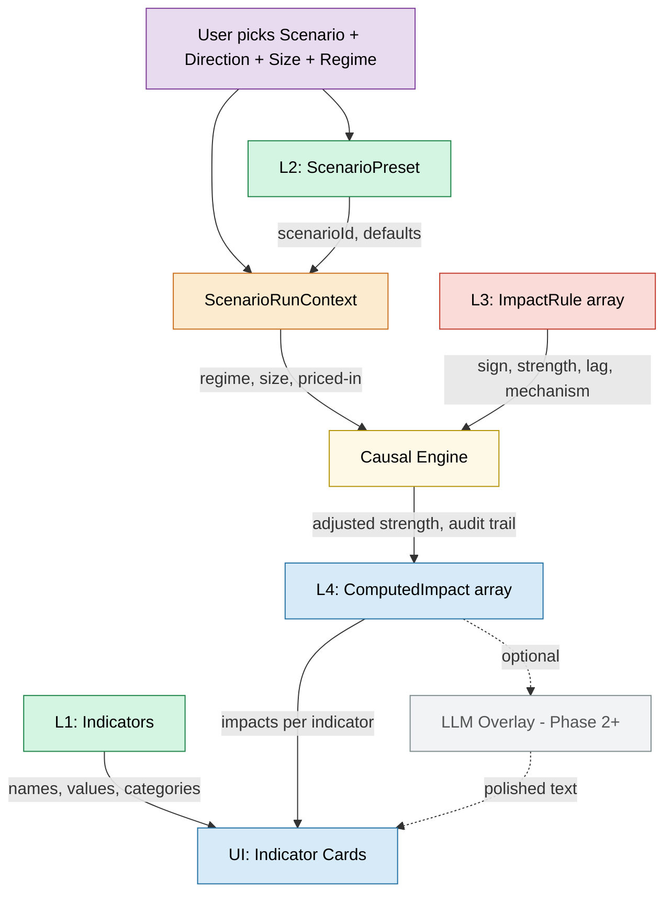

# MacroCausal — Architecture

This document describes the hybrid 4-layer architecture that powers scenario simulation in MacroCausal.

## Design Philosophy

> **Same scenario → same result, every time.**

The core causal logic is **static, curated, and version-controlled**. An LLM (Phase 2+) sits on top purely as a narrative layer — it never decides *what* happens, only *how to explain* what happened.

| What's static (authoritative) | What's dynamic (LLM-friendly, Phase 2+) |
|-------------------------------|------------------------------------------|
| Sign, strength, lag, confidence | Polished tooltip wording |
| Mechanisms, conditions, regime overrides | Beginner vs advanced phrasing |
| Surprise scaling, exceptions | "Tell me the chain reaction" walkthrough |
| Explanation templates | Cross-indicator comparisons, analogies |

---

## Architecture Diagram



---

## The 4 Layers

### Layer 1: Indicators (`indicators.js`)

**What the user sees on cards.** 24 economic variables grouped into 5 theme nodes.

| Field | Static/Dynamic |
|-------|---------------|
| `id`, `name`, `category`, `unit`, `source` | Static — versioned with app |
| `observation.value`, `.period` | Semi-static — updated with data refreshes |
| `observation.sentiment` | Static — derived from rules |

Each indicator belongs to a category that maps to a visual theme node:

| Category | Theme | Examples |
|----------|-------|---------|
| `policy-instruments` | 🏛️ Policy Instruments | Fed Funds Target, QE/QT Pace, Forward Guidance |
| `financial` | 📊 Financial Conditions | 2Y Yield, 10Y Yield, Mortgage Rates |
| `real-economy` | 📈 Real Economy | GDP Growth, Consumer Spending, Unemployment |
| `inflation` | 💲 Inflation | Core CPI, Core PCE, Headline PPI |
| `exogenous` | ⚡ Market Pricing & Risk | S&P 500, VIX, Oil |

---

### Layer 2: Scenarios (`scenarios.js`)

**Headline shocks as agnostic templates.** A single preset like `fed_hike_hawkish_surprise` covers 25bps, 50bps, and 75bps — the user picks direction and size at runtime.

**9 Phase 1 presets:**

| # | Shock Type | Scenario | Primary Node |
|---|-----------|----------|-------------|
| 1 | 🏛️ Policy | Fed Hawkish Surprise | `fed-funds-target` |
| 2 | 🏛️ Policy | Fed Higher-for-Longer | `forward-guidance` |
| 3 | 🏛️ Policy | Fed Dovish Surprise | `fed-funds-target` |
| 4 | 💲 Inflation | Core PCE Hotter | `core-pce` |
| 5 | 💲 Inflation | Core PCE Cooler | `core-pce` |
| 6 | 👷 Labor | Payrolls + Wages Hot | `wage-growth` |
| 7 | 👷 Labor | Unemployment Higher | `unemployment` |
| 8 | 📈 Growth | Consumer Spending Weaker | `consumer-spending` |
| 9 | 💳 Credit | Credit Spreads Widen | `corporate-borrowing` |

**User controls at runtime:**
- **Surprise Size** (S / M / L) — scales impact strength via per-rule multipliers
- **Regime** — soft landing, late cycle, recession risk, inflation scare, financial stress
- **Already Priced In** — dampens all strengths to 30%

---

### Layer 3: Impact Rules + Mechanisms (`impact-rules.js`, `mechanisms.js`)

**The heart of the hybrid model.** A scenario-to-indicator adjacency list where each rule carries full causal metadata.

#### ImpactRule fields

| Field | Type | Purpose |
|-------|------|---------|
| `sign` | `up` / `down` / `mixed` | Direction of effect |
| `strength` | 1–5 | Base magnitude |
| `lag` | `immediate` / `short` / `medium` / `long` | Time to propagate |
| `confidence` | 1–5 | How certain the effect is |
| `mechanism` | MechanismId | References the mechanism registry |
| `explanationTemplate` | string | Static fallback explanation |
| `regimeOverrides` | object or null | Partial overrides per regime (sign, strength, etc.) |
| `surpriseScaling` | `{ small, medium, large }` | Per-rule multipliers for surprise size |
| `conditionalOn` | ConditionClause[] or null | Structured conditions |
| `exceptions` | string[] or null | Edge-case notes |

#### Mechanism Registry (11 mechanisms)

Mechanisms are **reusable** across scenarios. Each has a machine-readable `id`, display `name`, and templated descriptions using `{scenarioLabel}` / `{targetLabel}` placeholders.

| ID | Name |
|----|------|
| `direct_policy_action` | Direct policy action |
| `policy_path_repricing` | Policy path repricing |
| `long_end_growth_inflation_mix` | Long-end yield mix (growth vs inflation) |
| `discount_rate_duration_assets` | Discount-rate effect (duration assets) |
| `risk_sentiment_volatility` | Risk sentiment and volatility |
| `pass_through_to_borrowing_rates` | Pass-through to borrowing costs |
| `financial_conditions_transmission` | Financial conditions transmission |
| `credit_risk_repricing` | Credit risk repricing |
| `labor_market_signal` | Labor market signal |
| `demand_growth_signal` | Demand and growth signal |
| `flight_to_quality` | Flight to quality |

---

### Layer 4: Causal Engine (`causal-engine.js`)

**Deterministic pipeline:** `ScenarioRunContext` → `ComputedImpact[]`

```
User picks scenario + controls
        │
        ▼
ScenarioRunContext { scenarioId, surpriseSize, regime, marketAlreadyPricedIn, persistence }
        │
        ▼
Filter IMPACT_RULES by scenarioId
        │
        ▼
For each rule:
  1. Start with base sign, strength, lag, confidence
  2. Apply regimeOverrides (if regime matches)
  3. Apply surpriseScaling (small / medium / large multiplier)
  4. Dampen if marketAlreadyPricedIn (×0.3)
  5. Boost if persistence = trend_confirming (×1.15)
        │
        ▼
ComputedImpact[] — sorted by lag, then strength descending
  • targetIndicatorId
  • sign, strength, lag, confidence
  • mechanism
  • explanationShort (from static template)
  • explanationSource ('static_template' | 'llm')
  • reasonsApplied[] — full audit trail
```

**Key properties:**
- **Deterministic** — same inputs + same rules = same outputs, every time
- **Auditable** — `reasonsApplied` shows exactly which adjustments fired
- **Explanation-aware** — `explanationSource` tracks static vs LLM-generated text

---

## UI: Propagation Visualization

When a scenario fires, the UI shows:

1. **HEADLINE IMPACT column** — each card gains a 4th column showing `↑ ●●●●○` or `↓ ●●○○○` per affected indicator
2. **Propagation arrows** — curved SVG arrows from the originating node to each downstream impacted node, color-coded and dash-styled by lag:

| Lag Bucket | Display Label | Line Style | Color |
|-----------|---------------|-----------|-------|
| immediate | minutes to days | Solid | Green `#4ade80` |
| short | days to weeks | Dashed `10,5` | Blue `#60a5fa` |
| medium | months | Dotted `4,6` | Gold `#eab308` |
| long | months | Sparse dots `2,8` | Red `#f87171` |

---

## File Map

```
econ-impact-map/
├── index.html           # Shell — loads scripts + scenario panel
├── styles.css           # Full styling (glassmorphism, scenario panel, impact badges)
├── indicators.js        # L1: 24 indicator definitions + observations
├── scenarios.js         # L2: 9 scenario presets
├── mechanisms.js        # L3: 11 reusable mechanism definitions
├── impact-rules.js      # L3: 60+ scenario-to-indicator rules
├── causal-engine.js     # L4: Deterministic engine
├── app.js               # Layout, rendering, scenario panel, interactions
├── ARCHITECTURE.md      # This file
└── README.md
```

---

## Roadmap

| Phase | Focus | Status |
|-------|-------|--------|
| **Phase 1** | 4-layer data model, 9 scenarios, 11 mechanisms, causal engine, scenario picker UI | ✅ Done |
| **Phase 2** | LLM narrative layer — polished tooltips, chain-reaction walkthroughs | Planned |
| **Phase 3+** | Beginner/advanced toggle, scenario composition, analogies, real-time data | Future |
